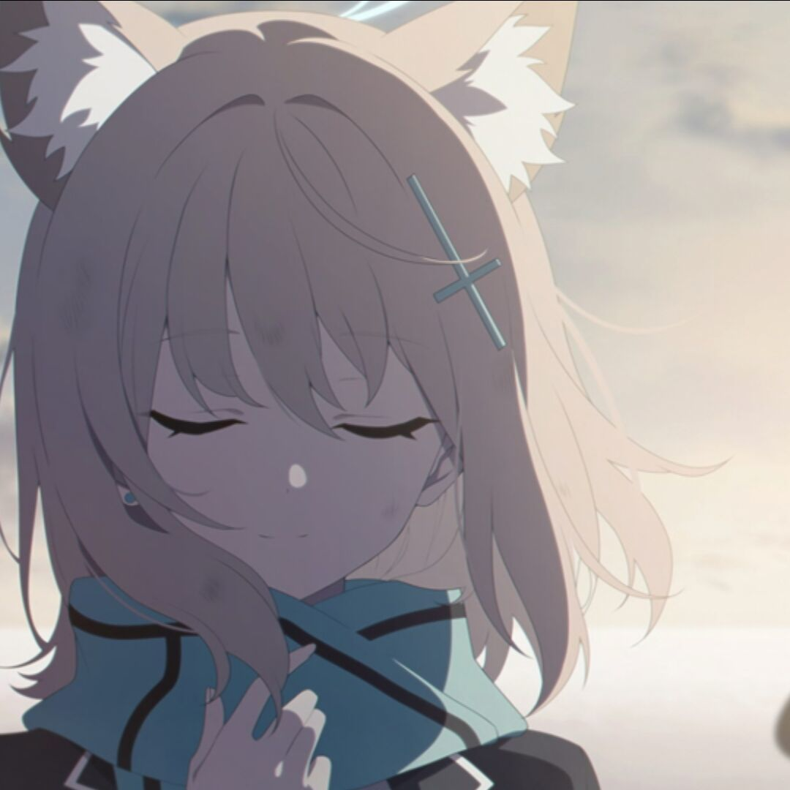

# 嗨！我是 <strong>MorkenDoen</strong> ! &nbsp;

[**[简体中文]**](README.md)
[**[English]**](README_en-US.md)

🎓 我今年 **16岁** ，正在上 **高中一年级**

💻 这个GitHub账号目前主要由 **我的哥哥** [[JularDepick]](https://github.com/JularDepick) 持有并维护

🫨 等到我 **考大学** 的时候，我的哥哥或许正在考 **研究生** ，我们能考上 **同一所个大学** 吗

🥲 等到我 **高中毕业的那一天** 这个账号将完全 **转交给我**

😐 哥哥 **不希望** 我走计算机这条路，但是给我注册GitHub是 **何意味**
